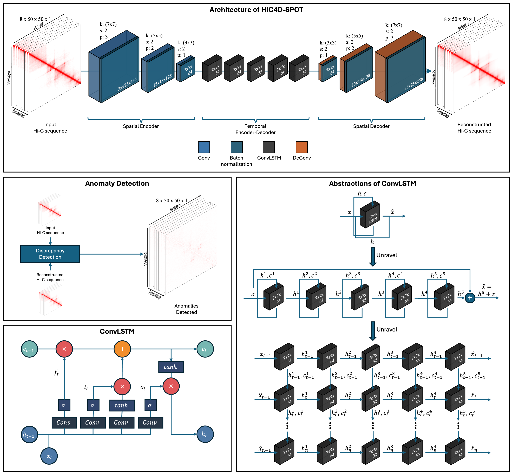

# HiC4D-SPOT: Spatiotemporal Outlier Detection Tool for Hi-C Data



This repository contains the code and pretrained models for **HiC4D-SPOT**, an unsupervised deep-learning framework designed to detect spatiotemporal anomalies in Hi-C data.

---

## 🔧 Setup Instructions

Before running any script, configure the necessary parameters in `args/args_mega.py` based on your experiment.

---

### 📦 Python Environment

- Tested on **Python 3.10.14**
- Create the conda environment using the provided `environment.yml` file:

  ```bash
  conda env create -f environment.yml
  conda activate hic4d-spot
  ```

- More info: [Conda Documentation](https://docs.conda.io/projects/conda/en/latest/user-guide/tasks/manage-environments.html#creating-an-environment-from-an-environment-yml-file)

---

## 📂 Datasets

Download and place the datasets in the `data` directory using the following structure:

| Dataset          | Description                        | GEO Accession | DOI                                          | Local Directory                                      |
| ---------------- | ---------------------------------- | ------------- | -------------------------------------------- | ---------------------------------------------------- |
| **Du**           | Preimplantation mouse embryos      | GSE82185      | https://doi.org/10.1038/nature23263          | `data/data_Du/allValidPairs`                         |
| **Reed**         | Human cell line dynamics           | GSE201376     | https://doi.org/10.1016/j.celrep.2022.111567 | `data/data_Reed/Hi-C`                                |
| **Zhang**        | Cardiomyocyte differentiation      | GSE116862     | https://doi.org/10.1038/s41588-019-0479-7    | `data/data_Zhang/Hi-C` and `data/data_Zhang/RNA_seq` |
| **Cohesin Loss** | Auxin-mediated cohesin degradation | GSE104334     | https://doi.org/10.1016/j.cell.2017.09.026   | `data/data_Cohesinloss_Rao/Hi-C`                     |

---

## ⚙️ Data Processing

### 1. Preprocessing

- Scripts are located in:  
  `codebase/data_{datasetName}/1_data_generation`

- Run the appropriate script based on your dataset.

### 2. Spatiotemporal Feature Generation

- Script: `codebase/src/generate_data.py`

- Run:

  ```bash
  python generate_data.py -id mega
  ```

---

## 🧠 Training HiC4D-SPOT

- Script: `codebase/src/train.py`

- Run:

  ```bash
  python train.py -id mega
  ```

---

## 🔍 Inference

- Script: `codebase/src/predict.py`

- Run:

  ```bash
  python predict.py -id mega
  ```

- Output will be saved in the `predictions/` directory.

---

## 📊 Visualization

- Script: `codebase/src/evaluate.py`

- Run:

  ```bash
  python evaluate.py -id mega
  ```

- Output will be saved inside the `eval/` directory within each model’s prediction directory.

---

## 📖 Citation

If you use **HiC4D-SPOT** in your research, please cite:

```
Bishal Shrestha, Zheng Wang, HiC4D-SPOT: Spatiotemporal Outlier Detection Tool for Hi-C Data.
```

---

## 📬 Contact

For questions, suggestions, or issues, please contact:

- **Zheng Wang, PhD**
- University of Miami
- Email: zheng.wang@miami.edu

---

Thank you for using **HiC4D-SPOT**!
